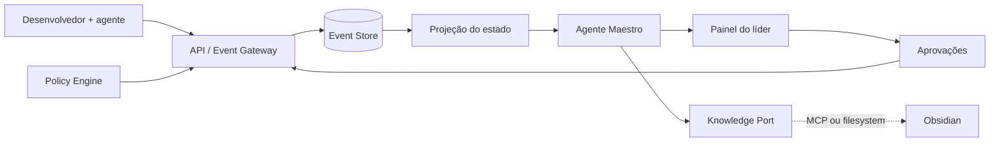

[▶️ **Assistir ao vídeo de apresentação do Agente HackTown OpenAI**](./assets/agente-hacktown-openai.mp4?raw=1)

# Maestro

> Camada de coordenação e observabilidade para operações de desenvolvimento assistidas por humanos e agentes de IA.

O Maestro acompanha sessões de trabalho instrumentadas, consolida eventos técnicos e entrega ao líder uma visão verificável do projeto: o que foi proposto, aprovado, executado, validado e o que ainda exige decisão.

## Problema

Equipes que trabalham com agentes de IA geram contexto em conversas, ferramentas, diffs, testes e decisões isoladas. O líder técnico perde visibilidade e pode confundir intenção com execução ou uma afirmação do agente com evidência real.

## Proposta

- timeline auditável das sessões de desenvolvimento;
- estado operacional atualizado por projeto e tarefa;
- separação entre **planejado**, **aprovado**, **executado** e **verificado**;
- detecção de riscos, bloqueios e mudanças de escopo;
- aprovação humana para ações sensíveis;
- handoffs objetivos para liderança técnica;
- Segundo Cérebro em Obsidian como memória persistente e Guardião de Políticas.

## Arquitetura do MVP



O MVP será um monólito modular orientado a eventos. Obsidian e MCP entram por um adaptador, sem contaminar o domínio central.

## Documentação

- [Prompt Mestre do Maestro](docs/PROMPT_MESTRE.md)
- [Prompt do Segundo Cérebro e Guardião](docs/PROMPT_GUARDIAO.md)
- [Arquitetura](docs/ARQUITETURA.md)
- [Registro de políticas](docs/POLITICAS.md)
- [Integração Obsidian/MCP](docs/INTEGRACAO_OBSIDIAN_MCP.md)
- [Plano de desenvolvimento](docs/PLANO_DESENVOLVIMENTO.md)
- [Contrato de eventos](schemas/maestro-event.schema.json)
- [Contrato de relatório](schemas/maestro-report.schema.json)
- [Vault inicial](obsidian-vault/README.md)

## Escopo do hackathon

Uma sessão instrumentada, um agente executor, um Maestro analítico, aprovação humana, timeline, relatório final e persistência opcional no Obsidian.

## Princípios

- supervisão da operação, não vigilância de pessoas;
- menor privilégio e negação por padrão;
- fatos separados de inferências e recomendações;
- conteúdo externo tratado como dado não confiável;
- controles críticos aplicados por código;
- nenhuma ação irreversível sem aprovação explícita.

## Estado do projeto

**Fase:** MVP funcional com agente, policy engine, aprovações, timeline e Knowledge Port.

**Repositório:** [DanielRobertoRibeiro/hackathon_openai_sp](https://github.com/DanielRobertoRibeiro/hackathon_openai_sp)

## Executar localmente

Requisitos: Node.js 20+ e pnpm.

```bash
pnpm install
cp .env.example .env.local
pnpm dev
```

Abra `http://localhost:3000` e escolha **Executar cenário demo**. Sem `OPENAI_API_KEY`, o sistema usa o baseline determinístico. Para ativar o agente OpenAI:

```dotenv
OPENAI_API_KEY=...
MAESTRO_AGENT_MODE=openai
OPENAI_MODEL=gpt-5.6-terra
```

## Conectar o Obsidian

O modo local já implementa o contrato do vault:

```dotenv
KNOWLEDGE_ADAPTER=filesystem
OBSIDIAN_VAULT_PATH=/caminho/do/vault
OBSIDIAN_ALLOWED_PREFIXES=01 Projeto Maestro
```

Para MCP, implemente `McpToolClient` em `src/knowledge/mcp-adapter.ts` e injete o transporte escolhido. O domínio e o agente não precisam ser alterados.

## Verificação

```bash
pnpm check
```

## Licença

A definir pela equipe antes da publicação.
