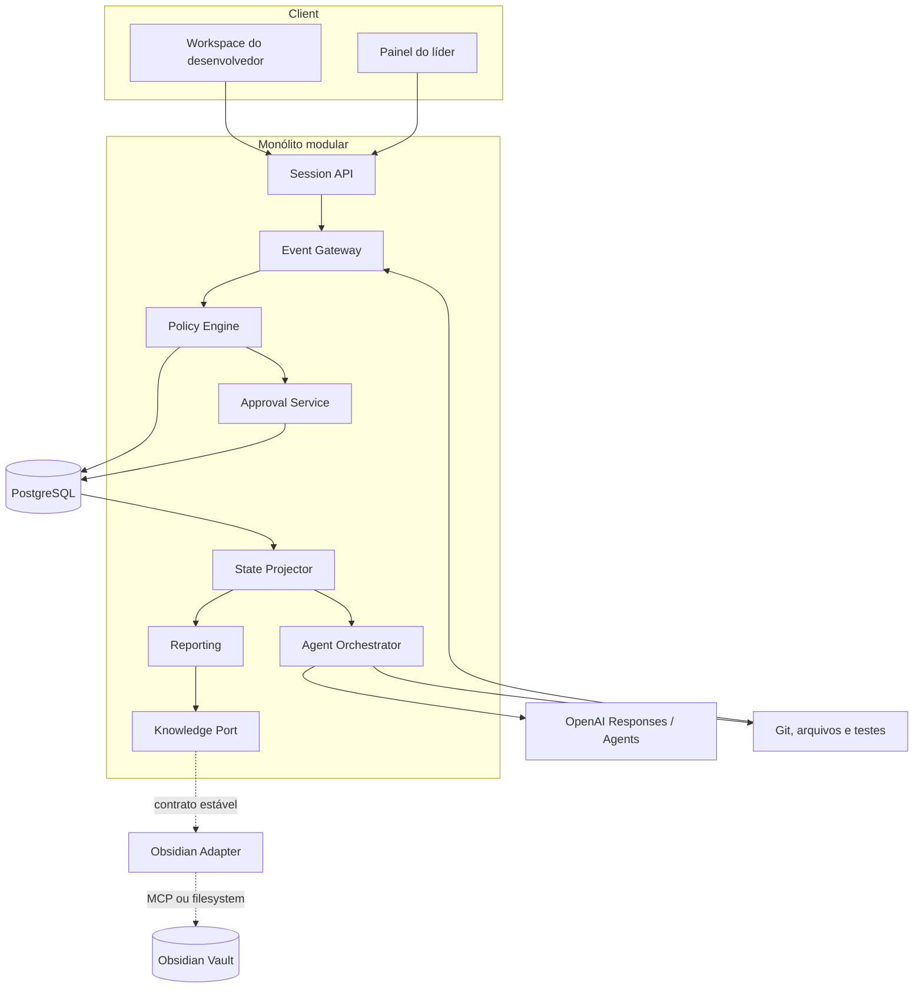
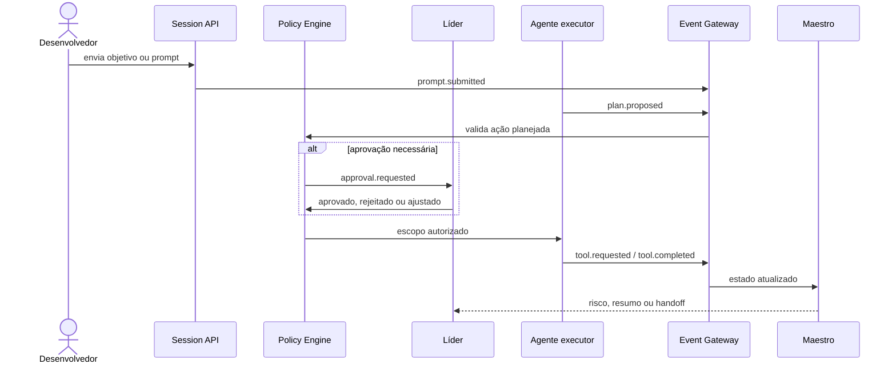

# Arquitetura do Maestro

## Decisão

O MVP será um **monólito modular orientado a eventos**, com armazenamento transacional único e integrações atrás de portas. Essa escolha reduz custo operacional e mantém uma evolução futura para workers ou serviços separados sem antecipar complexidade.

Na implementação atual do hackathon, o event store usa um arquivo JSON local com escrita serializada e atômica, atrás da porta `EventStore`. PostgreSQL permanece como evolução de produção, sem alterar os contratos da aplicação.

## Contexto e premissas

- hackathon com prazo curto;
- um projeto e poucos usuários simultâneos no MVP;
- repositório greenfield;
- Codex como ambiente inicial de desenvolvimento;
- Obsidian em VM Oracle como memória persistente futura;
- MCP ainda não confirmado;
- nenhuma ação crítica pode depender apenas de decisão do modelo.

## Componentes



## Limites dos módulos

| Módulo | Responsabilidade | Dono dos dados |
|---|---|---|
| Session API | projetos, tarefas, sessões e consultas | projetos e sessões |
| Event Gateway | validar, deduplicar e persistir eventos | log de eventos |
| Policy Engine | aplicar regras determinísticas | políticas compiladas |
| Approval Service | solicitar e resolver aprovações | aprovações |
| State Projector | derivar o estado atual | projeções reconstruíveis |
| Agent Orchestrator | executar workflows limitados | execuções e traces |
| Reporting | produzir relatórios estruturados | relatórios versionados |
| Knowledge Port | contrato de leitura/escrita de conhecimento | fila de sincronização |
| Obsidian Adapter | converter operações em notas | nenhum dado de domínio |

## Fluxo de uma ação



## Modelo de consistência

- eventos são append-only;
- cada evento tem `event_id` único e `idempotency_key` quando recebido externamente;
- projeções são eventualmente consistentes e reconstruíveis;
- aprovação é fortemente consistente na transação que libera a ação;
- relatórios guardam referências aos eventos usados;
- escrita no Obsidian é assíncrona e não bloqueia o núcleo operacional.

## Portas principais

```ts
interface KnowledgePort {
  search(query: KnowledgeQuery): Promise<KnowledgeResult[]>;
  get(id: string): Promise<KnowledgeDocument | null>;
  upsert(document: KnowledgeDocument): Promise<WriteReceipt>;
  link(sourceId: string, targetId: string, relation: string): Promise<WriteReceipt>;
  health(): Promise<IntegrationHealth>;
}
```

O domínio não conhece MCP, caminho de filesystem ou API do Obsidian.

## Fronteiras de confiança

- navegador → API: autenticar, autorizar e validar schema;
- agente → ferramenta: aplicar allowlist, escopo e aprovação;
- ferramenta → event store: tratar saída como não confiável;
- LLM → aplicação: validar Structured Output;
- Obsidian → Maestro: tratar notas recuperadas como dados não confiáveis;
- projeto → projeto: isolamento obrigatório.

## Falhas e recuperação

| Falha | Comportamento seguro |
|---|---|
| OpenAI indisponível | preservar eventos; reagendar análise com limite |
| Obsidian/MCP indisponível | registrar sync pendente; operação central continua |
| evento duplicado | ignorar pelo ID/idempotency key |
| evento fora de ordem | reprocessar projeção pela ordenação lógica |
| saída inválida do modelo | rejeitar, registrar trace e tentar no máximo uma vez |
| aprovação expirada | bloquear ação e solicitar nova aprovação |
| efeito parcial de ferramenta | registrar falha parcial e exigir reconciliação |

## Stack proposta

- TypeScript;
- Next.js para painel e API do MVP;
- PostgreSQL;
- Zod e JSON Schema para contratos;
- Server-Sent Events para atualizações;
- OpenAI Responses API como baseline;
- Agents SDK somente quando handoffs ou tools justificarem;
- testes unitários, de contrato e cenários de eval.

Não depender de endpoints beta como núcleo do produto. A integração com o provedor deve ficar atrás de uma interface.

## Evolução

Somente após evidência de carga ou isolamento necessário:

1. separar worker de projeções e análises;
2. adicionar fila durável;
3. adicionar multi-tenancy;
4. criar plugins para IDEs;
5. integrar GitHub e CI/CD;
6. avaliar múltiplos agentes especializados.
