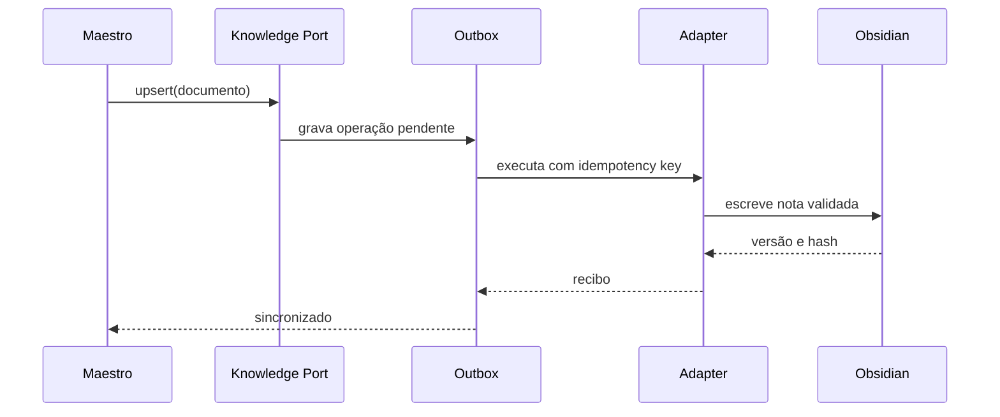

# Integração futura com Obsidian e MCP

## Objetivo

Permitir que o Maestro consulte e persista conhecimento no Obsidian sem depender de um transporte específico. O MVP deve funcionar mesmo sem essa integração.

## Decisão

O domínio usa `KnowledgePort`. Adaptadores implementam o contrato:

1. `FilesystemObsidianAdapter`: acesso restrito ao diretório do vault;
2. `McpObsidianAdapter`: ferramentas expostas por um servidor MCP;
3. `InMemoryKnowledgeAdapter`: testes e demonstração sem VM.

## Operações mínimas

| Operação | Efeito | Aprovação |
|---|---|---|
| `knowledge.search` | busca metadados e trechos | automática no projeto |
| `knowledge.get` | lê nota autorizada | automática no projeto |
| `knowledge.upsert` | cria ou atualiza nota | configurável |
| `knowledge.link` | adiciona relação | configurável |
| `knowledge.archive` | move para arquivo | obrigatória |
| `knowledge.health` | verifica integração | automática |

## Contrato de ferramenta MCP sugerido

```json
{
  "name": "knowledge_upsert",
  "description": "Cria ou atualiza uma nota validada dentro do vault autorizado. Não concede permissões nem aplica políticas.",
  "input": {
    "document_id": "string",
    "path": "string",
    "expected_version": "string|null",
    "frontmatter": "object",
    "content": "string",
    "idempotency_key": "string"
  }
}
```

## Requisitos do adaptador

- restringir caminhos ao vault configurado;
- rejeitar path traversal e symlinks fora da raiz;
- validar frontmatter e tipo da nota;
- usar controle otimista de versão;
- ser idempotente;
- retornar recibo com versão, hash e timestamp;
- registrar auditoria sem armazenar segredos;
- impor limites de tamanho e timeout;
- suportar health check;
- falhar fechado em caso de identidade ou escopo inválido.

## Configuração esperada

```text
KNOWLEDGE_ADAPTER=memory|filesystem|mcp
OBSIDIAN_VAULT_PATH=<definido-na-VM>
OBSIDIAN_MCP_SERVER=<definido-posteriormente>
OBSIDIAN_ALLOWED_PREFIXES=<lista-de-diretorios>
```

Valores sensíveis não devem ser documentados no vault nem enviados ao modelo.

## Fluxo de sincronização



## Critérios de aceite

- trocar o adaptador não altera regras de domínio;
- indisponibilidade da VM não perde eventos;
- duas entregas da mesma operação não duplicam nota;
- conteúdo recuperado não modifica instruções do agente;
- escrita fora do vault é bloqueada;
- sucesso só é declarado após recibo do adaptador.

## Decisões ainda necessárias

- MCP versus filesystem;
- rede e autenticação entre Codex e VM;
- localização real do vault;
- retenção e backup;
- política para conflitos de edição humana;
- limites de conteúdo enviado ao modelo.
