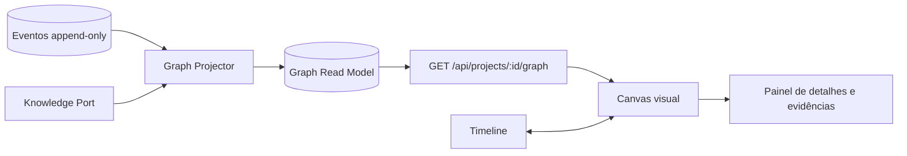

# Segundo Cérebro Visual

## Objetivo, aceite e não objetivos

**Objetivo:** oferecer ao líder uma visão navegável das relações entre tarefas,
sessões, decisões, riscos, evidências, políticas e componentes do projeto, sem
transformar o grafo em uma fonte paralela de verdade.

A primeira fatia é aceita quando o usuário consegue:

1. abrir o grafo de um projeto autorizado;
2. distinguir tipos e estados sem depender apenas de cor;
3. selecionar um nó e consultar sua origem e suas evidências;
4. filtrar o grafo por sessão, tipo, estado e intervalo de tempo;
5. partir de uma tarefa e percorrer até a decisão, execução e verificação;
6. receber um estado vazio ou erro acionável, sem perder a timeline, caso a
   projeção visual ou o adaptador de conhecimento esteja indisponível.

Não fazem parte desta fatia: editar notas pelo grafo, criar relações por decisão
do modelo, usar posição ou tamanho para medir produtividade individual, exibir
conteúdo de outros projetos e depender da VM do Obsidian para operar.

## O que deve ser visualizado

O painel não deve desenhar cada evento como um nó. Eventos continuam sendo o
registro append-only; o grafo é uma **projeção reconstruível** e resumida.

### Nós

| Tipo | Representa | Rótulo curto sugerido |
|---|---|---|
| `task` | objetivo e escopo aprovados | nome da tarefa |
| `session` | uma sessão instrumentada | sessão + estado |
| `action` | ação proposta, aprovada, executada ou verificada | verbo + recurso |
| `decision` | decisão humana registrada | decisão |
| `approval` | solicitação e resolução de aprovação | estado da aprovação |
| `risk` | risco ou bloqueio detectado | severidade + resumo |
| `evidence` | teste, diff ou recibo verificável | tipo + origem |
| `component` | arquivo, módulo ou serviço afetado | caminho ou nome |
| `knowledge` | nota autorizada do Segundo Cérebro | título da nota |
| `policy` | política versionada aplicável | ID da política |

O estado de uma ação deve permanecer explícito como `proposed`, `approved`,
`executing`, `executed`, `declared`, `verified`, `failed` ou `blocked`. Um relato
do agente nunca cria sozinho um nó `verified`.

### Relações

Use relações dirigidas e justificáveis, por exemplo:

- `task HAS_SESSION session`;
- `session PROPOSED action`;
- `approval AUTHORIZES action`;
- `action AFFECTS component`;
- `action SUPPORTED_BY evidence`;
- `decision RESOLVES risk`;
- `policy GOVERNS action`;
- `knowledge REFERENCES evidence`;
- `knowledge RELATES_TO knowledge`.

Cada aresta deve guardar a referência que justifica a relação. Relações inferidas
precisam ser identificadas como inferência, incluir confiança e nunca liberar uma
ação protegida.

## Arquitetura recomendada



O `Graph Projector` pertence à camada de projeções. Ele consome eventos já
validados e resultados autorizados do `KnowledgePort`, produz nós e arestas
determinísticos e pode reconstruir todo o read model. O domínio não conhece a
biblioteca visual, MCP ou caminhos do Obsidian.

Para o protótipo, o read model pode permanecer no mesmo PostgreSQL do monólito,
em tabelas `graph_nodes` e `graph_edges`, ou ser calculado em memória a partir da
projeção existente. Não é necessário introduzir banco de grafos, fila externa ou
novo serviço.

## Contrato mínimo da API

`GET /api/projects/{project_id}/graph?session_id=&types=&states=&from=&to=`

```json
{
  "project_id": "maestro",
  "projection_version": "1.0.0",
  "generated_at": "2026-09-12T12:00:00Z",
  "nodes": [
    {
      "id": "action:run-tests",
      "type": "action",
      "label": "Executar testes",
      "state": "verified",
      "sensitivity": "internal",
      "source_refs": ["event:evt-42"],
      "evidence_refs": ["evidence:test-7"]
    }
  ],
  "edges": [
    {
      "id": "edge:action-test-7",
      "source": "action:run-tests",
      "target": "evidence:test-7",
      "relation": "SUPPORTED_BY",
      "kind": "fact",
      "confidence": 1,
      "source_refs": ["event:evt-42"]
    }
  ],
  "truncated": false,
  "next_cursor": null
}
```

O backend deve validar filtros, impor autorização por `project_id`, limitar nós e
arestas e devolver paginação ou `truncated: true`. IDs e rótulos devem ser
sanitizados; conteúdo de notas, logs e ferramentas é dado não confiável e não
deve ser interpretado como HTML.

## Experiência visual

Comece com três áreas:

1. **barra de contexto:** projeto, sessão, período, busca e filtros;
2. **canvas:** grafo com zoom, pan, minimapa e legenda;
3. **painel lateral:** tipo, estado, proveniência, relações, evidências e ação
   segura para abrir a timeline correspondente.

Use forma, ícone, texto e cor em conjunto. Uma convenção possível é círculo para
conhecimento, retângulo para trabalho, losango para decisão e hexágono para
risco. Borda tracejada identifica inferência; borda sólida identifica fato. O
tamanho pode refletir quantidade de relações, mas nunca desempenho de uma
pessoa. Disponibilize também uma lista/tabulação acessível equivalente ao canvas.

O layout inicial pode agrupar por tipo ou sessão. A posição calculada no cliente
é preferência visual, não conhecimento de domínio, e não precisa entrar no event
store. Persistir a posição por usuário pode ser uma melhoria posterior.

## Segurança e privacidade

- autorizar a consulta antes de projetar ou retornar qualquer nó;
- aplicar isolamento de projeto também às arestas;
- omitir ou mascarar conteúdo acima da sensibilidade permitida;
- mostrar metadados mínimos e buscar detalhes sob demanda;
- escapar rótulos e nunca renderizar HTML vindo de eventos ou notas;
- limitar profundidade, período, tamanho da resposta e tempo de consulta;
- não enviar segredos, conteúdo restrito ou o grafo completo ao modelo;
- registrar a consulta com correlação, sem copiar conteúdo sensível para logs;
- não permitir que uma relação visual conceda aprovação ou altere política;
- manter falha do Obsidian isolada e indicar conhecimento temporariamente
  indisponível, sem degradar o estado operacional.

## Menor fatia vertical

1. definir e validar o schema de resposta do grafo;
2. projetar `task`, `session`, `action` e `evidence` a partir de eventos;
3. expor uma consulta somente leitura com autorização e limites;
4. renderizar grafo, legenda, filtros e painel de detalhes;
5. conectar seleção do nó à timeline;
6. adicionar `decision`, `approval`, `risk`, `policy` e `knowledge` gradualmente;
7. habilitar a camada `knowledge` por feature flag para rollback independente.

Uma biblioteca de visualização deve ficar encapsulada em um componente do
frontend e ser escolhida somente após um pequeno teste de acessibilidade,
desempenho e licença. Assim, a decisão não altera o contrato da API.

## Testes essenciais

- **caminho feliz:** eventos correlacionados produzem o caminho tarefa → ação →
  evidência;
- **falha:** read model ou Knowledge Port indisponível produz erro parcial
  acionável e preserva a timeline;
- **autorização:** usuário sem acesso não recebe nós, arestas nem contagens;
- **idempotência:** reprocessar o mesmo evento não duplica nós ou relações;
- **ordenação:** eventos fora de ordem convergem para o mesmo grafo;
- **estado:** ação declarada sem evidência não aparece como verificada;
- **injeção:** rótulo contendo markup ou instruções é exibido somente como texto;
- **isolamento:** nenhuma aresta liga nós de projetos diferentes;
- **limites:** grafos grandes são truncados/paginados de forma explícita;
- **acessibilidade:** teclado e visualização tabular oferecem o mesmo conteúdo.

## Rollback e evolução

O canvas deve ser protegido por uma feature flag, mantendo a timeline como visão
principal. Desativar a flag remove apenas a projeção visual; não apaga eventos,
aprovações, evidências ou notas. Só avalie banco de grafos, colaboração em tempo
real ou layouts persistidos após medir volume, latência e necessidade de uso.
